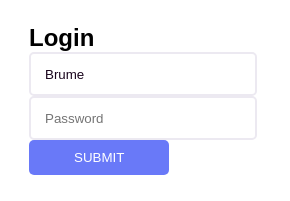

# Brume



```rust
impl Page for Login {
    fn body(&self) -> Box<dyn Viewable> {
        Body::new(
            Column::new()
                .child(Title::h2("Login"))
                .child(Input::new("Username"))
                .child(Input::new("Password"))
                .child(Button::new("Submit"))
        )
    }
}
```

### TODO

- [x] Add layout widgets. Row, Column
- [ ] Add callbacks
- [ ] Add more widgets and styles
- [ ] Responsive support
- [ ] Add Brume to the crate.io
- [ ] Linux and Android support
- [ ] Add theme

### Widgets

* Body
* Column, Row
* Container WIP
* Title
* Text
* Button
* Link
* Label
* Input, Search WIP
* Divider WIP
* TextArea WIP
* RadioButton WIP
* CheckBox WIP
* ContextMenu WIP
* TextBox WIP
* Loading WIP
* SnackBar WIP
* Alert WIP
